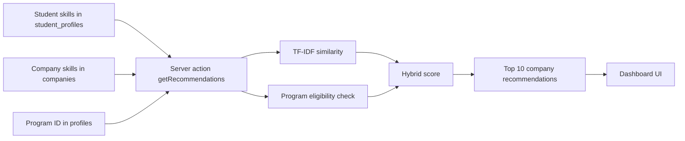

# TF-IDF Algorithm in the OJT Recommender System

## Overview

The OJT Recommender System uses TF-IDF to compare a student's skills against the skills required by each company. In this project, TF-IDF is not used for general text search. It is used for **skill matching**.

That means:

- a student's `technical_skills` become one document
- each company's `required_skills` become one document
- the algorithm compares those documents and returns a similarity score

The final result is a recommendation score that helps the system rank companies for a student.

## What the algorithm does for the system

TF-IDF gives the system a structured way to answer this question:

> How closely do the student's skills match the skills each company wants?

It does this by:

1. Normalizing skill names so matching is consistent
2. Building a vocabulary from all known company skills and the student's skills
3. Calculating how important each skill is
4. Converting the student's skills and company skills into numeric vectors
5. Comparing those vectors using cosine similarity
6. Combining the similarity score with program eligibility to produce the final recommendation score

Without TF-IDF, the app would only do simple string checks. With TF-IDF, it can rank companies more intelligently.

## Where it lives in the codebase

The algorithm is split into a small architecture:

- [lib/algorithm/tfidf.ts](../lib/algorithm/tfidf.ts) contains the core TF-IDF and cosine similarity utilities
- [lib/algorithm/hybrid.ts](../lib/algorithm/hybrid.ts) combines TF-IDF with program eligibility and produces the final score
- [lib/algorithm/index.ts](../lib/algorithm/index.ts) re-exports the algorithm functions
- [app/actions/recommendations.ts](../app/actions/recommendations.ts) is the server action that fetches data and calls the recommender
- [app/dashboard/client.tsx](../app/dashboard/client.tsx) renders the recommendation results in the UI

## System architecture

The recommendation feature follows a simple server-side pipeline:

1. The student opens the dashboard
2. The client clicks **Generate Recommendations**
3. The dashboard calls the server action `getRecommendations()`
4. The server action fetches:
   - the student's profile
   - the student's technical skills
   - all companies
5. The recommendation engine calculates scores
6. The top results are returned to the client
7. The UI renders the ranked company cards

### High-level flow



## Why TF-IDF is used here

The project needs a way to compare two skill lists fairly.

For example:

- Student skills: React, SQL, Node.js
- Company skills: React, SQL, PHP, Node.js

A simple overlap count could work, but it would treat all matches equally.
TF-IDF gives the algorithm a better representation of how skills overlap across the whole company corpus.

This matters because:

- common skills should not dominate the score too much
- less common skills can carry more value
- the system should still produce a score even on small datasets

## Core TF-IDF concepts

TF-IDF stands for:

- **TF** = Term Frequency
- **IDF** = Inverse Document Frequency

### 1. Term Frequency

In this project, TF is binary.

That means a skill is either:

- present: `1`
- absent: `0`

This makes sense because a skill list usually does not need repeated words.

If the student has `React`, the TF for `React` is `1`.
If the student does not have `Figma`, the TF for `Figma` is `0`.

### 2. Inverse Document Frequency

IDF tells us how rare a skill is across all documents.

The implementation uses a smoothed formula:

$$
IDF(t) = \log\left(\frac{1 + N}{1 + df(t)}\right) + 1
$$

Where:

- $N$ = total number of documents
- $df(t)$ = number of documents containing term $t$

This smoothed version is important because the dataset is small. Without smoothing, some terms can produce zero weight too easily.

### 3. TF-IDF

The final weight for each skill is:

$$
TF\text{-}IDF(t, d) = TF(t, d) \times IDF(t)
$$

This gives every skill a numeric importance score.

## How the code works

### `normalise(skill)`

In [lib/algorithm/tfidf.ts](../lib/algorithm/tfidf.ts), every skill is normalized using:

- trim whitespace
- convert to lowercase

This prevents mismatches such as:

- `React`
- `react`
- `React`

All of those should be treated as the same skill.

### `buildVocabulary(docs)`

This function creates a complete list of unique skills from all documents.

Example:

- Student skills: React, SQL, Node.js
- Company A skills: React, PHP
- Company B skills: SQL, Figma

Vocabulary becomes:

- `figma`
- `node.js`
- `php`
- `react`
- `sql`

This vocabulary is the shared feature space for all vectors.

### `computeTF(doc, vocabulary)`

This converts one skill list into a vector using the vocabulary.

If the vocabulary is:

- React
- SQL
- Node.js
- PHP

And the student has:

- React
- SQL

Then TF becomes:

- React = 1
- SQL = 1
- Node.js = 0
- PHP = 0

### `computeIDF(docs, vocabulary)`

This measures how common each skill is across the full dataset.

Skills that appear in many company documents get lower weight.
Skills that appear in fewer documents get higher weight.

### `computeTFIDF(doc, vocabulary, idf)`

This multiplies TF and IDF for every term.

That means a skill only contributes strongly if:

- it is present in the document, and
- it has a useful IDF weight

### `cosineSimilarity(a, b)`

After TF-IDF vectors are built, the system compares them using cosine similarity.

The formula is:

$$
\cos(\theta) = \frac{A \cdot B}{|A| \times |B|}
$$

Where:

- $A \cdot B$ is the dot product
- $|A|$ and $|B|$ are vector magnitudes

The result is between:

- `0` = no similarity
- `1` = identical direction

In the UI, this is converted to a percentage.

### `skillSimilarityScore(studentSkills, companySkills, allCompanySkills)`

This is the main helper used for matching.

It:

1. builds the vocabulary from all company skills plus the student skills
2. computes IDF weights
3. computes TF-IDF vectors for the student and the target company
4. returns a rounded percentage similarity score

This function is the main TF-IDF entry point for the rest of the system.

## Why the project uses hybrid scoring

TF-IDF alone is not enough.

A company may be a perfect skill match but not eligible for the student's program.
Or the company may be eligible but not a strong skill match.

That is why the project uses a hybrid score.

## Hybrid scoring architecture

The hybrid logic lives in [lib/algorithm/hybrid.ts](../lib/algorithm/hybrid.ts).

It combines:

- TF-IDF similarity
- program eligibility

The current constants are:

- `SIMILARITY_WEIGHT = 0.7`
- `PROGRAM_WEIGHT = 0.3`
- `PROGRAM_MATCH_BONUS = 100`
- `MAX_RECOMMENDATIONS = 10`

### Hybrid score formula

$$
HybridScore = round(SimilarityScore \times 0.7 + ProgramScore \times 0.3)
$$

Where:

- `SimilarityScore` is the TF-IDF percentage
- `ProgramScore` is `100` when the student's program matches the company eligibility list
- `0` otherwise

### Why this design works

This gives a balanced result:

- skill match matters most
- program eligibility still influences the final ranking

A company that matches both skill and program will rank higher than one that only matches skills.

## Recommendation flow in the app

The full flow is handled by [app/actions/recommendations.ts](../app/actions/recommendations.ts).

### Step 1: Authenticate the user

The server action gets the current user from Supabase auth.

If the user is missing, the action returns:

- `Not authenticated`

### Step 2: Load student profile

It fetches the student's row from `student_profiles` using `user_id`.

If no student profile exists, the action returns:

- `Please update your skills first.`

### Step 3: Load the student's program

It fetches the `program_id` from `profiles`.

This is used in the program eligibility calculation.

### Step 4: Load all companies

It fetches every company from the `companies` table.

Each company contains:

- name
- description
- required skills
- eligible programs
- contact details
- optional logo/image URL

### Step 5: Run the algorithm

The action calls:

```ts
generateRecommendations(student, companies);
```

### Step 6: Return the ranked list

The results are sorted from highest score to lowest score, then trimmed to the top 10.

## Data model behind the algorithm

The algorithm depends on a few database tables.

### `profiles`

Stores:

- user role
- full name
- student program

### `student_profiles`

Stores:

- technical skills
- project experience

### `companies`

Stores:

- company name
- description
- required skills
- eligible programs
- contact details
- image/logo URL

### `company_applications`

Stores:

- who applied
- to which company
- uploaded resume path
- uploaded resume URL
- message
- timestamps

## How the UI uses the results

The dashboard UI in [app/dashboard/client.tsx](../app/dashboard/client.tsx) displays:

- the recommendation rank
- the company name
- the hybrid match score
- the similarity score
- the required skills as badges
- clickable cards that open company details

It also shows a visualization section with:

- highest score
- average score
- number of program matches
- bars for each recommendation

## Company details and applications

The recommendation card links to [app/companyDetails/[id]/page.tsx](../app/companyDetails/%5Bid%5D/page.tsx).

That page shows:

- company name
- logo / picture
- email address
- location address
- website or social media link
- contact number
- eligible programs
- required skills
- an Apply button

When the user applies:

- the resume is uploaded to Supabase Storage
- the application is saved in `company_applications`
- an email is sent to the company with the resume attached

## Strengths of this implementation

### 1. Simple and explainable

The algorithm is easy to explain to users and coordinators.

### 2. Normalized matching

Capitalization and whitespace differences do not break matches.

### 3. Balanced ranking

Skill relevance and program eligibility both matter.

### 4. Server-side scoring

The computation runs on the server, so the client only receives results.

### 5. Top 10 limitation

The result set stays focused and avoids overwhelming the student.

## Limitations

### 1. Skill lists are treated as sets

Because TF is binary, repeated keywords do not increase score.

### 2. Small datasets can still be sparse

If there are very few companies, some similarity rankings may not be very distinct.

### 3. It is still keyword-based

This is not semantic AI matching. It does not understand synonyms deeply.

For example:

- `UI Design` and `User Interface Design` are not automatically expanded unless both appear in the data.

### 4. Program eligibility is still a separate rule

A company may match skills well but still be filtered lower if program eligibility does not match.

## Possible future improvements

If the project grows, you could improve matching by adding:

- synonym normalization
- skill taxonomy / skill ontology
- weighted skill groups
- semantic embeddings
- internship level or seniority weighting
- company location preference scoring
- user preference settings

## Practical example

Imagine:

Student skills:

- React
- SQL
- Node.js

Company A skills:

- React
- SQL
- Node.js
- TypeScript

Company B skills:

- Photoshop
- Illustrator
- Figma

The algorithm will:

- give Company A a much higher TF-IDF similarity score
- give Company B a much lower score
- then adjust based on whether the student program is eligible

So the student sees the best-fit companies first.

## Summary

TF-IDF is the core ranking engine of the OJT Recommender System.

It helps the app:

- compare student skills against company requirements
- generate numeric similarity scores
- rank companies from best match to weakest match
- combine skill relevance with program eligibility
- support a clean and explainable recommendation experience

In short, TF-IDF is what turns raw skill lists into meaningful company recommendations.
